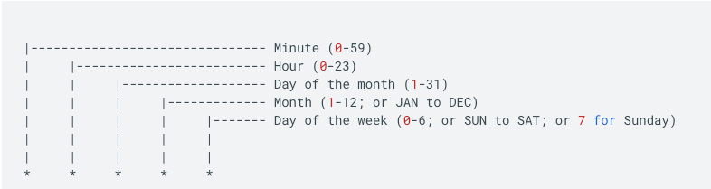
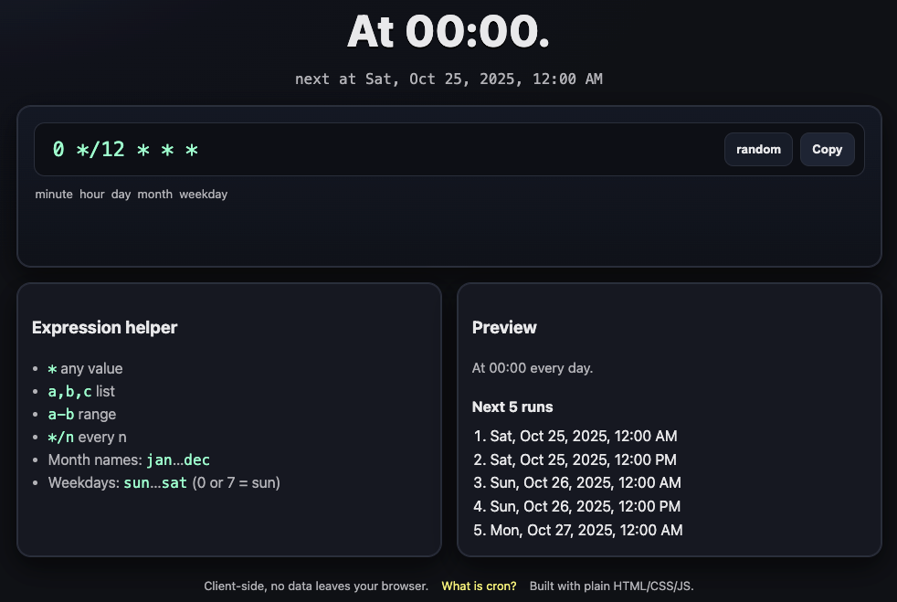

# 🕒 Cron Scheduler

A tiny static web app (no dependencies) that lets you type a 5‑field cron expression and see the next run times.

## [Cron job format](https://cloud.google.com/scheduler/docs/configuring/cron-job-schedules)

- A schedule is defined using the unix-cron string format (`* * * * *`) which is a set of five fields in a line, indicating when the job should be executed.
- The time fields have the following format and possible values, and must follow this order:

## Features

- Parses standard 5‑field cron: `minute|hour|day|month|weekday`
- Supports lists (`,`), ranges (`-`), steps (`*/n`), and names (`Jan..Dec`, `Sun..Sat`).
- Shows the next 5 execution times in your local timezone.
- Random button to generate simple “`m h * * *`” examples.
- Clipboard copy button.
- Pure client‑side — works offline.

## Notes

- Weekday can be `0..6` (Sun=0) or use names like `mon`.
- `7` for weekday is treated as Sunday as well.
- This is a minimal tool and does not implement advanced cron quirks (like `L`, `W`, `#` occurrences)

-------

## Deployment

